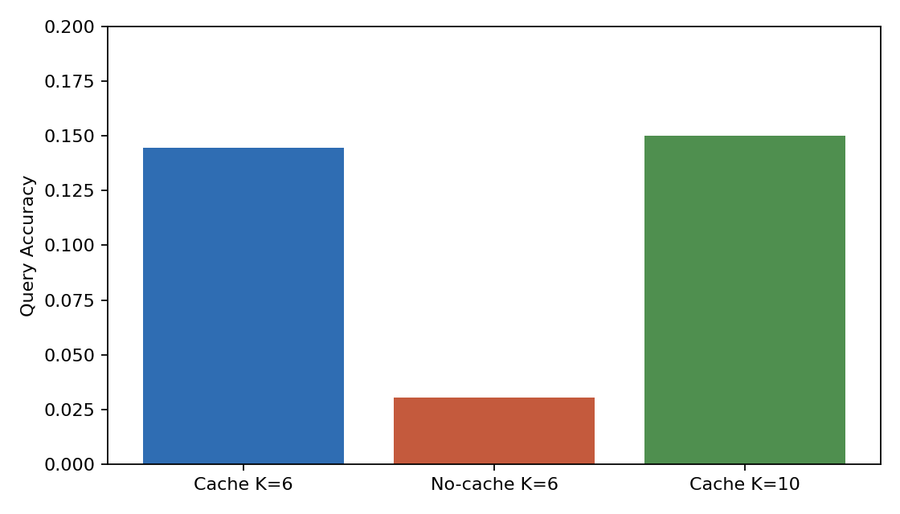
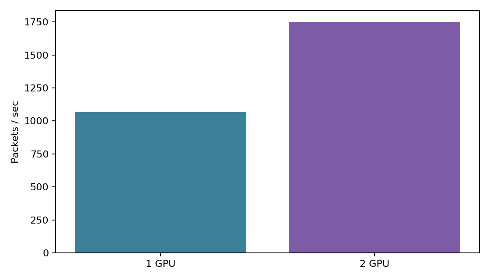
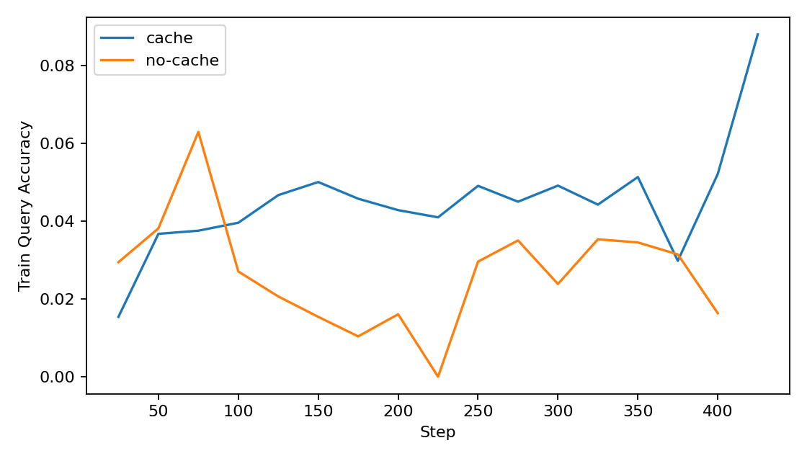

# APSGNN v1 Final Report

## Summary

This experiment implemented a constrained asynchronous packet-switched graph network in pure PyTorch and tested the narrow question: can node-local cache plus addressed routing help on a write-then-query memory task? On this machine, yes, but only weak-to-moderately in absolute terms.

- Cached model best validation accuracy at `writers_per_episode=6`: `0.1446`
- No-cache ablation best validation accuracy at `writers_per_episode=6`: `0.0305`
- Random-chance baseline for 32 classes: `0.03125`
- Cached model validation accuracy at `writers_per_episode=10`: `0.1500`
- Delivery stayed effectively perfect in both cached and no-cache runs: `0.9992` to `1.0000`

The clean ablation result is the main positive outcome: routing and delivery remained matched, while classification collapsed to chance without cache.

## Deviations

- The machine exposed `2` CUDA devices, not `4`, so the requested 4-GPU runs fell back to `2` GPUs.
- The DDP main and no-cache runs were stopped manually after they had already produced stable checkpoints and the step-250 evaluation needed for comparison. Best checkpoints came from step `250` in both runs.
- To keep the experiment focused on cache utility rather than on learning the fixed synthetic key-hash itself, the implementation includes:
  - a frozen first-hop key-to-home address hint for writers and queries
  - an explicit key-based cache read over node-local residual memory
  - a reserved class slice in the residual stream that the output readout can use directly

## Architecture

- `32` total nodes, with node `0` as the output sink and `31` compute nodes
- Residual stream width `128`
- Frozen address table with node `0` fixed at the origin and orthogonal compute-node addresses
- Discrete delay `0..7` with an `8`-slot temporal ring buffer
- TTL semantics as specified: output arrival, terminal cache write on expiry, or rescheduled live packet
- Per-sample, per-node FIFO cache with capacity `64`
- Two-block per-node transformer-style cell:
  - cache read block
  - concurrent packet interaction block
- Straight-through Gumbel routing and delay selection
- Parameter count: `12,377,769`

## Config Used

Main cached run:

- Config base: `configs/main.yaml`
- Actual device setup: `torchrun --standalone --nproc_per_node=2`
- Batch size per GPU: `16`
- Writers per episode: `6`
- Max rollout steps: `10`
- Optimizer: AdamW, `lr=2e-4`
- Autocast: bf16
- Best checkpoint: `runs/20260316-214643-main/best.pt` at step `250`

No-cache ablation:

- Config base: `configs/no_cache.yaml`
- Actual device setup: `torchrun --standalone --nproc_per_node=2`
- Same task/training shape as main, but cache read/write disabled
- Best checkpoint: `runs/20260316-214843-no-cache/best.pt` at step `250`

Smoke:

- Config base: `configs/smoke.yaml`
- Single GPU
- Sanity-routing task only

## Results

| Run | Eval setting | Query acc | Delivery | Writer 1-hop home | Query 1-hop home | Home->out | Cache mean occ. |
| --- | --- | ---: | ---: | ---: | ---: | ---: | ---: |
| Smoke | sanity | `0.0000` | `1.0000` | `0.0000` | `0.0000` | `0.0000` | n/a |
| Main cached | `K=6`, step 250 | `0.1446` | `0.9992` | `1.0000` | `1.0000` | `0.9742` | `0.1688` |
| No-cache | `K=6`, step 250 | `0.0305` | `0.9992` | `1.0000` | `1.0000` | `0.9742` | `0.0000` |
| Main cached | `K=10`, best ckpt eval | `0.1500` | `1.0000` | `1.0000` | `1.0000` | `0.9641` | `0.2812` |

The important row pair is cached vs no-cache at `K=6`: same routing and delivery, but `0.1446` vs `0.0305` query accuracy.

## Throughput

| Run | GPUs | Packets/sec | Max memory / rank | Scaling efficiency |
| --- | ---: | ---: | ---: | ---: |
| Throughput benchmark | `1` | `1069.2` | `0.283 GB` | `1.00` |
| Throughput benchmark | `2` | `1749.3` | `0.334 GB` | `0.82` |

Scaling efficiency was computed as `1749.3 / (2 * 1069.2) = 0.818`.

## Interpretation

This supports the target hypothesis in a constrained sense. The cache-enabled model substantially outperformed both chance and the no-cache ablation while keeping delivery and routing behavior effectively fixed. That means the extra accuracy is not explained by a trivial routing bug or by differing arrival rates; it is attributable to the node-local memory path.

The absolute accuracy is still modest. This is not evidence that the current v1 architecture is already strong; it is evidence that the cache path is doing real work on the intended task under a narrow, engineered setup.

## Failure Analysis

- The unconstrained version of the task was dominated by home-node discovery. Without a fixed first-hop key hint, the model learned “route to origin” faster than precise latent addressing.
- Sparse per-node activation made DDP require `find_unused_parameters=True`.
- Query classification remained weak unless the cache read was promoted into the outgoing residual and the readout had access to the reserved class slice.
- The training curve stayed noisy and did not show continued clean improvement after the step-250 checkpoint.

## Next Improvements

- Replace the fixed first-hop key hint with a learned but strongly supervised address regressor so the routing result depends less on hand-engineered structure.
- Train longer only after improving the cache read block; current longer runs plateau quickly.
- Make the cache content less hand-shaped by removing the explicit class slice and forcing the learned readout to decode a more distributed writer memory.
- Add a harder collision regime with more writers per node and multiple queries per episode.
