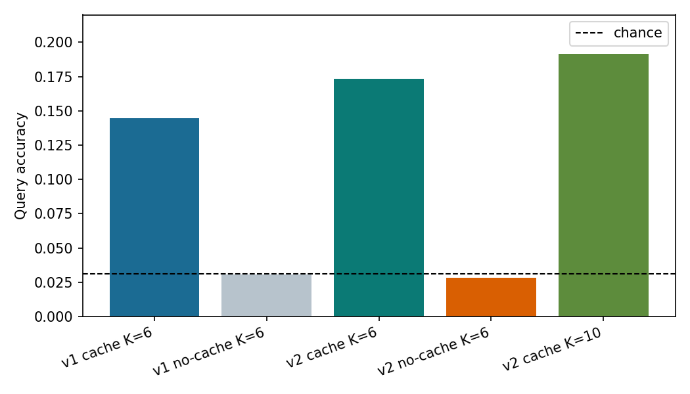
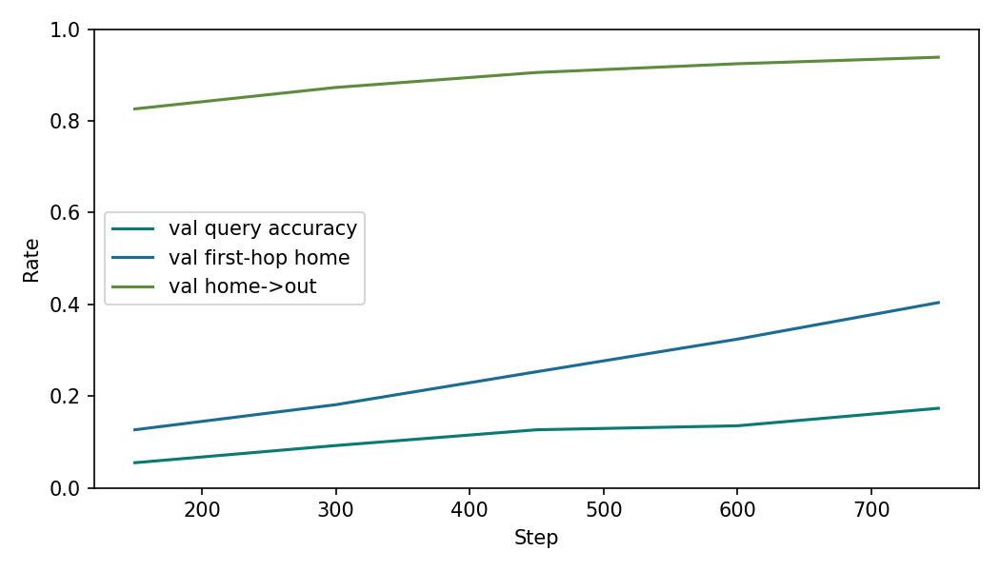
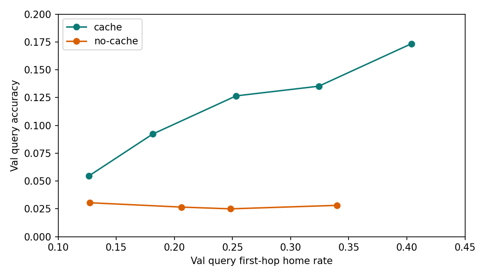

# APSGNN v2 Final Report

## Summary

APSGNN v2 keeps the v1 task, cache path, explicit key-based cache read, and reserved class slice, but removes the frozen first-hop key-to-home hint. In its place, v2 adds a learned first-hop router with strong CE supervision and a configurable first-hop teacher-forcing schedule during training.

This was the main research question:

- Does the cache advantage survive once the frozen first-hop hint is removed?

The answer is yes, but with a clearer diagnosis than v1:

- the cache advantage does survive
- first-hop home-node discovery is now the dominant bottleneck
- cache readout still matters once routing becomes moderately competent

The strongest matched comparison is at step `600`, where cached and no-cache v2 have very similar first-hop routing rates, but query accuracy still differs sharply:

- Cached v2 at step `600`: `0.1353`
- No-cache v2 at step `600`: `0.0281`
- Chance baseline for `32` classes: `0.03125`

That makes the v2 result more credible than v1: the cache benefit persists without the frozen first-hop hint, and the main remaining weakness is routing, not a trivial cache-vs-no-cache training artifact.

## What Changed From v1

- Removed the frozen first-hop key-to-home address hint in the v2 configs.
- Added a learned first-hop router head over compute nodes `1..31`.
- First-hop router inputs combine packet residual, key projection, role embedding, TTL embedding, and current-node embedding.
- First hop is strongly supervised with the existing writer/query home-node targets.
- Added first-hop teacher forcing on the executed route during training only, with explicit annealing and logging.
- Preserved the explicit key-based cache read and reserved class slice so v2 isolates the effect of removing the hint.

## Actual Environment

- Visible CUDA devices: `2`
- Device names: `NVIDIA RTX PRO 6000 Blackwell Max-Q Workstation Edition` x2
- PyTorch: `2.12.0.dev20260316+cu130`
- APSGNN v2 parameter count: `12,398,536`

The original 4-GPU scripts again fell back cleanly to `2` GPUs on this machine.

## Configs Used

Smoke:

- `configs/v2_smoke.yaml`
- memory task, `writers_per_episode=4`
- `train_steps=250`

Main cached:

- `configs/v2_learned_router.yaml`
- `writers_per_episode=6`
- `train_steps=1500`
- `eval_interval=150`
- `batch_size_per_gpu=16`
- `lr=2e-4`
- `aux_writer_weight=2.0`
- `aux_query_weight=2.0`
- first-hop teacher forcing: `1.0 -> 0.0` over `900` steps

Main no-cache:

- `configs/v2_learned_router_no_cache.yaml`
- identical to cached v2 except cache read/write disabled

## Results

### Main Comparison

| Run | Setting | Query acc | Delivery | Writer 1-hop home | Query 1-hop home | Home->out | Cache mean occ. |
| --- | --- | ---: | ---: | ---: | ---: | ---: | ---: |
| v1 cache | `K=6` | `0.1446` | `0.9992` | `1.0000` | `1.0000` | `0.9742` | `0.1688` |
| v1 no-cache | `K=6` | `0.0305` | `0.9992` | `1.0000` | `1.0000` | `0.9742` | `0.0000` |
| v2 cache | matched step `600` | `0.1353` | `0.9992` | `0.3948` | `0.3242` | `0.9248` | `0.1688` |
| v2 no-cache | matched step `600` | `0.0281` | `1.0000` | `0.4138` | `0.3398` | `0.9284` | `0.0000` |
| v2 cache | best ckpt step `750`, `K=6` | `0.1734` | `1.0000` | `0.4719` | `0.4039` | `0.9390` | `0.1688` |
| v2 cache | best ckpt step `750`, `K=10` | `0.1914` | `1.0000` | `0.4769` | `0.4102` | `0.9252` | `0.2812` |

Two comparisons matter:

1. `v1 cache` vs `v2 cache`
   `0.1446 -> 0.1734`
   v2 did not collapse after removing the frozen hint; with a learned router, cached performance actually improved.

2. `v2 cache` vs `v2 no-cache` at matched routing difficulty
   At step `600`, first-hop routing rates are close, but accuracy is `0.1353` vs `0.0281`.

That is the cleanest evidence that the cache benefit survived hint removal.

### Smoke

The v2 smoke run was intentionally small and used the real memory task rather than the old sanity-only smoke. It finished successfully and already showed the routing bottleneck:

- best smoke validation query accuracy: `0.1016`
- best smoke validation writer/query first-hop home rates: `0.1973` / `0.1719`

### Training Dynamics

The cached v2 run improved mainly by raising first-hop home accuracy:

- step `150`: query acc `0.0547`, query first-hop home `0.1266`
- step `300`: query acc `0.0922`, query first-hop home `0.1813`
- step `450`: query acc `0.1266`, query first-hop home `0.2531`
- step `600`: query acc `0.1353`, query first-hop home `0.3242`
- step `750`: query acc `0.1734`, query first-hop home `0.4039`

Once the query reaches home, the home-to-output leg remains comparatively easy in both cached and no-cache v2 runs.

## Throughput

I did not rerun the dedicated throughput benchmark for v2, but the existing train logs provide a useful approximation on `2` GPUs:

- cached v2 training throughput around step `600`: about `1822` packets/sec
- no-cache v2 training throughput around step `600`: about `2363` packets/sec

No-cache remains faster, as expected.

## Interpretation

This is a stronger result than v1. The frozen first-hop hint is gone, yet the cached model still beats the no-cache model by a wide margin. The best cached v2 checkpoint reaches `0.1734` at `K=6`, and even the matched step-`600` comparison shows `0.1353` vs `0.0281` while first-hop routing metrics are already close. That means the cache path is still doing useful work after the highest-priority scaffold was removed.

The main bottleneck is now routing. Cached and no-cache v2 differ far less in delivery and home-to-output behavior than in query accuracy, and the cached model’s gains track first-hop home-node accuracy almost directly. The experiment therefore isolates home-node discovery as the limiting factor once cache readout is kept intact.

## Failure Analysis

- The learned first-hop router needed heavy supervision plus teacher forcing to stay trainable; without that support, the forward path was too brittle.
- Query accuracy remained tightly coupled to first-hop home accuracy. v2 did not uncover a new cache-read bottleneck before routing improved.
- The no-cache model stayed near chance even after its first-hop routing rates became comparable to the cached run, which is good evidence for cache utility but also shows that the classification task remains hard without the memory path.
- Because the cached run was interrupted after the best step-`750` checkpoint and the no-cache run after step `600`, the comparison is strongest at matched logged checkpoints rather than at identical end-of-run horizons.

## Optional De-Scaffolding Probe

Not run.

Reason:

- routing is still the dominant bottleneck
- removing the class slice or weakening explicit cache read now would confound the main v2 conclusion

## Next Recommended Experiment

Not `remove class slice` yet.

Not `weaken explicit cache read` yet.

Not `increase collision difficulty` yet.

The next best move is something else:

- keep the v2 learned-router setup
- improve first-hop routing only, for example with a slightly stronger router head or a short address-regression auxiliary on the first hop
- then rerun the same cached vs no-cache comparison

Reason:

- v2 already shows the cache benefit survives hint removal
- the remaining headroom is clearly limited by home-node discovery
- de-scaffolding the cache path further before routing improves would mostly test optimization fragility, not memory usefulness
