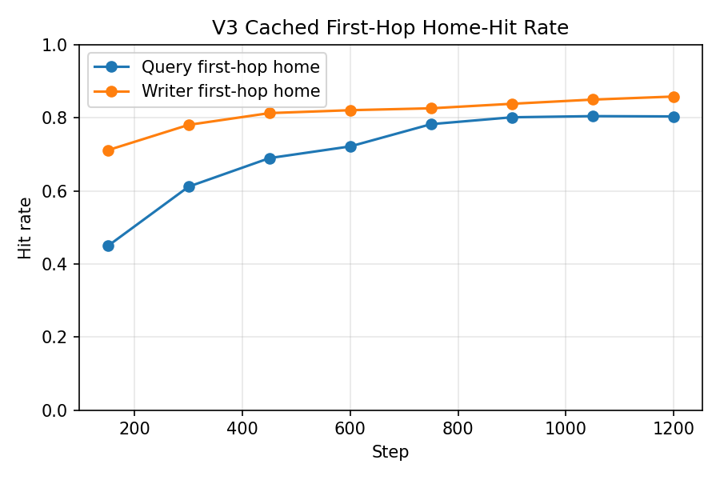
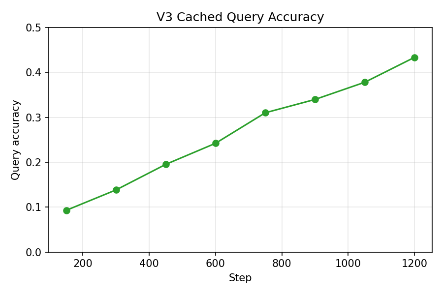
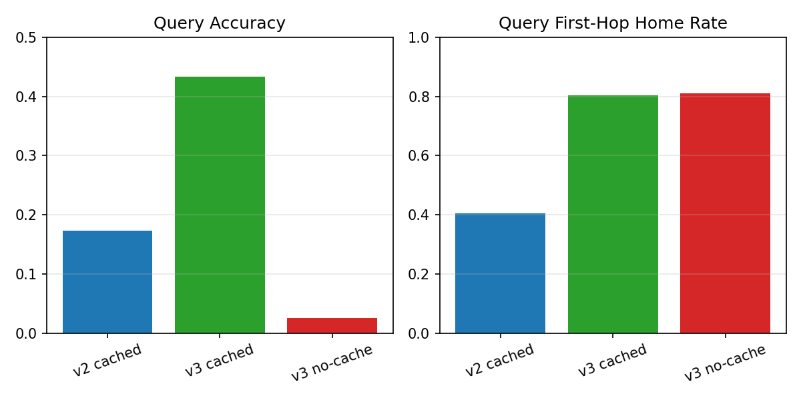

# APSGNN v3 Router Report

## Summary

APSGNN v3 keeps the v2 task, cache path, explicit key-based cache read, reserved class slice, and later-hop routing unchanged. The only intended change is a stronger first-hop router.

The v3 research question was:

- can a stronger first-hop router materially improve home-node discovery, and does cached accuracy rise with it while a matched no-cache control remains near chance?

The answer is yes.

- v2 cached best (`K=6`): query first-hop home `0.4039`, query accuracy `0.1734`
- v3 cached best (`K=6`): query first-hop home `0.8039`, query accuracy `0.4336`
- v3 no-cache matched step `1200` (`K=6`): query first-hop home `0.8109`, query accuracy `0.0250`

This is the cleanest result in the repo so far. First-hop routing was a real bottleneck in v2. Improving it roughly doubled the query home-hit rate and more than doubled cached query accuracy, while the no-cache control stayed at chance even with almost identical routing and delivery.

## What Changed From v2

- Replaced the v2 residual-heavy first-hop router with a key-centric router family.
- Kept later-hop address/delay routing unchanged.
- Kept the explicit key-based cache read unchanged.
- Kept the reserved class slice unchanged.
- Added configurable first-hop router variants:
  - Variant A: key-centric CE router
  - Variant B: key-centric CE router plus small first-hop address auxiliary
- Preserved training-time first-hop teacher forcing, with the same explicit logging and eval-time disable path.

## Router Variants

### Variant A: key-centric CE router

- key is the primary input
- role embedding, TTL embedding, and current-node embedding are auxiliary inputs
- residual input disabled in the selected configs
- 3-layer MLP backbone, hidden size `384`
- separate writer/query heads over compute nodes `1..31`
- CE supervision only on first-hop destination

### Variant B: key-centric CE router + address auxiliary

- same backbone and heads as Variant A
- adds a small first-hop auxiliary address regression toward the frozen target node address

## Variant Selection

Selection criterion:

- primary: validation query first-hop home-hit rate
- secondary: validation query accuracy

Selection runs used the same `600`-step cached budget on `2` GPUs.

| Variant | Val query acc | Val query 1-hop home | Val writer 1-hop home | Val home->out |
| --- | ---: | ---: | ---: | ---: |
| CE only | `0.2422` | `0.7219` | `0.8210` | `0.9647` |
| CE + aux | `0.2219` | `0.6398` | `0.7882` | `0.9604` |

Variant A won on the primary metric and also on accuracy, so it became the main v3 router.

## Actual Environment

- Visible CUDA devices: `2`
- Device names: `NVIDIA RTX PRO 6000 Blackwell Max-Q Workstation Edition` x2
- PyTorch: `2.12.0.dev20260316+cu130`
- Scripts requesting `4` GPUs again fell back cleanly to `2`

## Configs Used

Selection:

- `configs/v3_router_ce_search.yaml`
- `configs/v3_router_aux_search.yaml`
- `train_steps=600`

Main cached:

- `configs/v3_router_best.yaml`
- selected Variant A
- `train_steps=1200`
- `batch_size_per_gpu=16`
- `lr=2e-4`
- first-hop teacher forcing: `1.0 -> 0.0` over `1200` steps

Main no-cache:

- `configs/v3_router_best_no_cache.yaml`
- same router and training shape as cached v3
- cache read/write disabled

## Main Results

| Run | Setting | Query acc | Delivery | Query 1-hop home | Writer 1-hop home | Home->out | Cache mean occ. |
| --- | --- | ---: | ---: | ---: | ---: | ---: | ---: |
| v2 cached | best ckpt, `K=6` | `0.1734` | `1.0000` | `0.4039` | `0.4719` | `0.9390` | `0.1688` |
| v3 cached | best ckpt, `K=6` | `0.4336` | `1.0000` | `0.8039` | `0.8583` | `0.9681` | `0.1688` |
| v3 no-cache | matched step `1200`, `K=6` | `0.0250` | `1.0000` | `0.8109` | `0.8581` | `0.9684` | `0.0000` |
| v3 cached | best ckpt, `K=10` | `0.4477` | `1.0000` | `0.8023` | `0.8602` | `0.9603` | `0.2812` |

Two comparisons matter:

1. `v2 cached` vs `v3 cached`
   First-hop home-hit nearly doubled: `0.4039 -> 0.8039`
   Query accuracy rose strongly: `0.1734 -> 0.4336`

2. `v3 cached` vs `v3 no-cache`
   Routing and delivery are matched at step `1200`, but accuracy is `0.4336` vs `0.0250`

That means v3 answers the intended question cleanly:

- yes, first-hop routing was a major bottleneck in v2
- improving it materially improved cached performance
- the cache effect still survives once routing is matched

## Throughput

The existing train logs give a useful approximate throughput on `2` GPUs:

- v3 cached around step `1200`: `1748` packets/sec
- v3 no-cache around step `1200`: `2343` packets/sec

No-cache remains faster, as expected.

## Interpretation

v3 strongly supports the claim that first-hop home-node discovery was a real limiting factor in v2. Once the router became key-centric and the model could reliably hit the latent home node, cached query accuracy climbed from `0.1734` to `0.4336`. That is a much larger improvement than anything obtained by the earlier routing scaffolds alone.

At the same time, the matched no-cache control shows that routing is no longer enough by itself. At step `1200`, cached and no-cache v3 have almost identical first-hop home-hit rates (`0.8039` vs `0.8109`) and home-to-output rates (`0.9681` vs `0.9684`), yet no-cache accuracy remains essentially chance. So the node-local memory path is still doing decisive work even after the routing bottleneck was reduced sharply.

## Is First-Hop Routing Still The Dominant Bottleneck?

Not in the same way as v2.

v2 was clearly routing-limited. v3 improved first-hop routing enough that the experiment now exposes a stronger memory-read bottleneck:

- routing can now be matched between cached and no-cache
- cached accuracy is still far below first-hop home-hit rate
- no-cache remains at chance despite matched routing

So first-hop routing still matters, but it is no longer the only major blocker. The remaining scaffolding around cache readout is now a more useful target for the next experiment.

## Next Recommended Experiment

Not `remove class slice` yet.

Not `increase collision difficulty` yet.

The next best move is:

- `weaken explicit cache read`

Reason:

- v3 already showed that better first-hop routing materially improves cached performance
- routing is now good enough to compare cached vs no-cache at matched difficulty
- the next unanswered question is whether the cache benefit survives if the explicit key-based cache read becomes less hand-shaped

Removing the class slice should come after that, once the cache-read scaffold has been tested directly.
