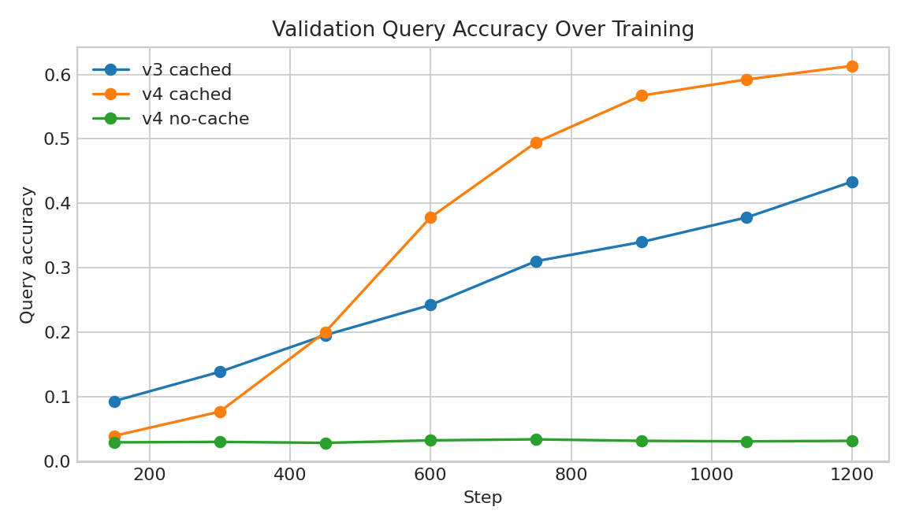
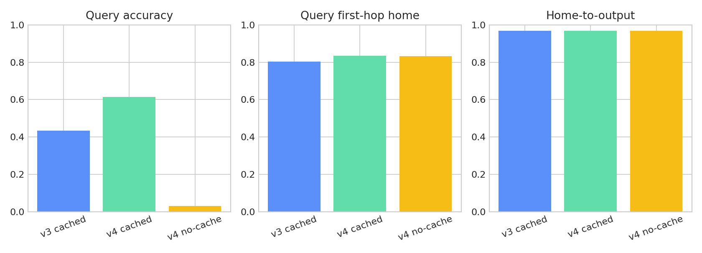
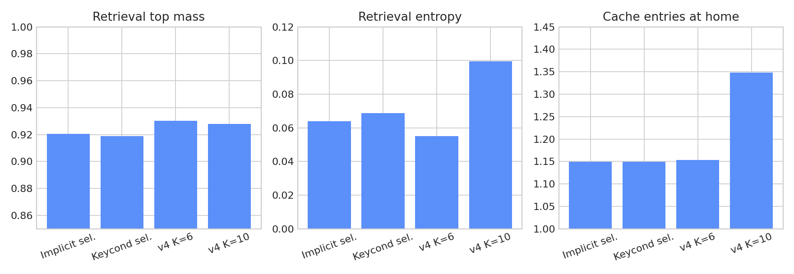

# APSGNN v4 Retrieval Report

## Summary

APSGNN v4 keeps the strong v3 first-hop router fixed and changes retrieval only. The v4 question was:

- can the cache effect survive when the old explicit raw-key cache read is replaced by a weaker learned retrieval mechanism?

The answer is yes.

- v3 cached best (`K=6`): query accuracy `0.4336`
- v4 cached best (`K=6`): query accuracy `0.6133`
- v4 no-cache matched step `1200` (`K=6`): query accuracy `0.0312`

This is a stronger memory result than v3. Routing stayed tightly controlled between cached and no-cache, but the learned implicit retriever still preserved a large cached advantage.

## What Changed From v3

- Kept the v3 key-centric CE first-hop router architecture unchanged.
- Warm-started v4 from the v3 cached checkpoint: `runs/20260317-055916-v3-router-best/best.pt`
- Froze first-hop router weights for the v4 selection runs and main runs.
- Kept the reserved class slice unchanged.
- Kept later-hop address and delay routing unchanged.
- Replaced the v3 explicit raw-key cache read with learned retrieval variants over cached residuals only.

## Retrieval Variants

### Variant A: implicit learned retrieval

- cache query comes from packet hidden state only
- no raw routing key is used in the similarity path
- cache entries use learned key/value projections from stored residuals
- retrieved context is fused back through a learned projection

### Variant B: learned key-conditioned retrieval

- cache query comes from a learned function of packet hidden state plus key features
- still no direct raw-key matching or explicit lookup
- cache entries still use learned key/value projections from stored residuals

## Variant Selection

Selection runs used `600` cached training steps on `2` visible GPUs, warm-started from the v3 cached checkpoint with the first-hop router frozen.

Selection criterion:

- primary: validation query accuracy
- secondary: routing parity and retrieval diagnostics

| Variant | Val query acc | Val query 1-hop home | Val home->out | Retrieval top mass | Retrieval entropy |
| --- | ---: | ---: | ---: | ---: | ---: |
| Implicit learned retrieval | `0.3781` | `0.8273` | `0.9690` | `0.9206` | `0.0639` |
| Key-conditioned retrieval | `0.3727` | `0.8273` | `0.9690` | `0.9187` | `0.0689` |

Routing was effectively matched. The implicit variant won on the primary metric and also showed slightly sharper retrieval concentration, so it became the selected v4 retriever.

## Actual Environment

- Visible CUDA devices: `2`
- Device names: `NVIDIA RTX PRO 6000 Blackwell Max-Q Workstation Edition` x2
- PyTorch: `2.12.0.dev20260316+cu130`
- Scripts requesting `4` GPUs again fell back cleanly to `2`

## Configs Used

Selection:

- `configs/v4_retrieval_implicit_search.yaml`
- `configs/v4_retrieval_keycond_search.yaml`
- `train_steps=600`
- `init_checkpoint=runs/20260317-055916-v3-router-best/best.pt`
- `freeze_first_hop_router=true`

Main cached:

- `configs/v4_retrieval_best.yaml`
- selected Variant A: `cache_read_variant=learned_implicit`
- `train_steps=1200`
- `batch_size_per_gpu=16`
- `lr=2e-4`
- `freeze_first_hop_router=true`
- `init_checkpoint=runs/20260317-055916-v3-router-best/best.pt`

Main no-cache:

- `configs/v4_retrieval_best_no_cache.yaml`
- same router setup, warm-start, and training shape as cached v4
- cache read and cache write disabled

## Main Results

| Run | Setting | Query acc | Delivery | Query 1-hop home | Writer 1-hop home | Home->out | Retrieval top mass |
| --- | --- | ---: | ---: | ---: | ---: | ---: | ---: |
| v3 cached | best ckpt, `K=6` | `0.4336` | `1.0000` | `0.8039` | `0.8583` | `0.9681` | n/a |
| v4 cached | best ckpt, `K=6` | `0.6133` | `1.0000` | `0.8352` | `0.8773` | `0.9693` | `0.9303` |
| v4 no-cache | matched step `1200`, `K=6` | `0.0312` | `1.0000` | `0.8320` | `0.8771` | `0.9692` | `0.0000` |
| v4 cached | best ckpt, `K=10` | `0.5836` | `1.0000` | `0.8266` | `0.8787` | `0.9615` | `0.9279` |

Two comparisons matter:

1. `v3 cached` vs `v4 cached`
   Routing changed only slightly: query first-hop home `0.8039 -> 0.8352`
   Accuracy rose strongly: `0.4336 -> 0.6133`

2. `v4 cached` vs `v4 no-cache`
   Routing and delivery are tightly matched at step `1200`, but accuracy is `0.6133` vs `0.0312`

That is the cleanest v4 answer:

- yes, the cache effect survives removal of the old explicit raw-key retrieval path
- the learned implicit retriever is enough to preserve a large cached advantage

## Retrieval Diagnostics

The cache still stores residuals only, so v4 diagnostics focus on concentration rather than ground-truth writer ids:

- `retrieval_top_mass`
- `retrieval_entropy`
- `retrieval_cache_entries`

At `K=6`, the selected v4 cached checkpoint reached:

- retrieval top mass: `0.9303`
- retrieval entropy: `0.0550`
- cache entries at target home node: `1.1536`

At `K=10`, it reached:

- retrieval top mass: `0.9279`
- retrieval entropy: `0.0996`
- cache entries at target home node: `1.3487`

These diagnostics show that the learned implicit retriever remains sharply focused even without the old explicit raw-key matching path. The current task is still relatively low-collision at the home node, but the learned retriever is not behaving like a diffuse average over cache entries.

## Throughput

Approximate train throughput from the step-`1200` logs on `2` GPUs:

- v4 cached: `1493` packets/sec
- v4 no-cache: `2315` packets/sec

The learned retriever is slower than no-cache, as expected, but still well within the existing single-node budget.

## Interpretation

v4 strengthens the memory claim substantially. The old explicit cache read path is no longer necessary to produce a large cached advantage on this task. The selected v4 retriever uses only learned projections over cached residuals and a hidden-state-derived query, yet cached accuracy rises to `0.6133` while the matched no-cache control remains at chance.

Just as important, routing did not materially regress or diverge between cached and no-cache. Query first-hop home-hit is `0.8352` for cached and `0.8320` for no-cache, while home-to-output is `0.9693` and `0.9692`. That keeps the interpretation clean: the v4 difference is a retrieval and memory difference, not a routing artifact.

## Does The Cache Effect Survive Weaker Retrieval?

Yes.

It survives in the strongest of the two planned senses:

- the stricter implicit variant works
- cached accuracy remains far above no-cache under matched routing
- the learned retriever is sharply concentrated by its own diagnostics

So explicit raw-key cache matching is not carrying the result anymore.

## Is Retrieval The Remaining Bottleneck?

Less than before, but not completely solved.

The learned retriever works well on the current task, yet the diagnostics also show that the target home node usually contains only about `1.15` cache entries at `K=6` and `1.35` at `K=10`. That means v4 is not yet a heavy collision regime. The next unanswered question is whether the learned retriever still works when it has to choose among multiple competing memories more often.

## Next Recommended Experiment

Not `remove class slice` yet.

Not `revisit first-hop routing`.

The next best move is:

- `increase collision difficulty`

Reason:

- v4 already shows that the cache effect survives weaker learned retrieval
- routing is now stable enough that retrieval is the clean comparison axis
- current retrieval diagnostics suggest the home node often has only one or a little more than one relevant cache entry on average
- increasing collisions is the most direct way to test whether the learned retriever is actually selecting among competing memories rather than benefiting from a mostly low-ambiguity home cache
